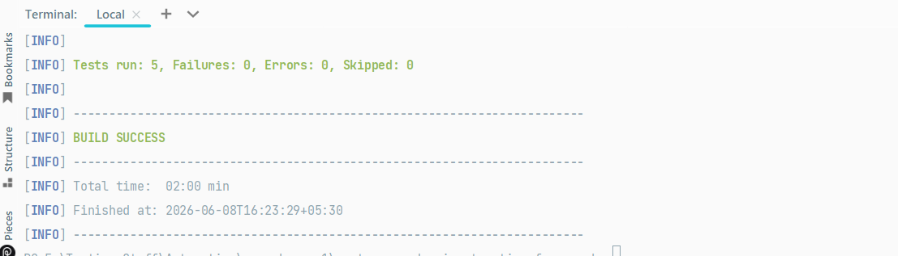

# Rest Assured API Automation Framework

## Tech Stack
- Java 17
- Rest Assured 5.4.0
- TestNG 7.x
- Maven
- Jackson Databind
- Extent Reports
- JSONPlaceholder API

## API Tests Covered
- POST — Create user (201 Created)
- GET — Get all users (200 OK)
- GET — Get single user by ID (200 OK)
- PUT — Update user (200 OK)
- DELETE — Delete user (200 OK)

## How To Run
```bash
git clone https://github.com/Raul2212/rest-assured-api-automation-framework
cd rest-assured-api-automation-framework
mvn clean test
```

## Test Results
